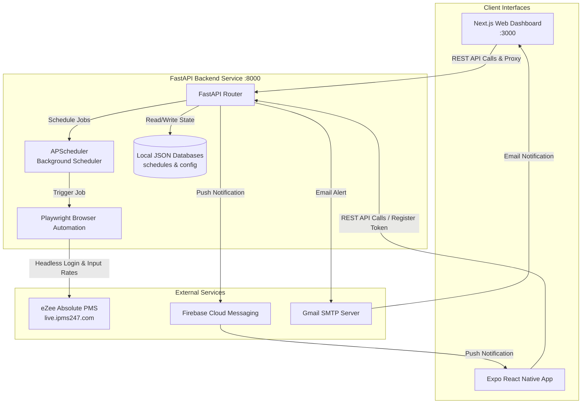

# Hotel Shreegopal Price & Night Audit Automation System

A robust, full-stack automation system designed for **Hotel Shreegopal** to schedule and automate room rate updates and night audits on the **eZee Reservation PMS (eZee Absolute)**.

This repository is structured as a monorepo consisting of:

1. **Python FastAPI Backend**: Automates browser tasks using Playwright, schedules jobs via APScheduler, and sends push/email notifications.
2. **Next.js Web Frontend**: A premium, responsive web dashboard for hotel managers to set schedules and view statuses.
3. **Expo React Native Mobile App**: A cross-platform mobile application for managers to control prices and night audits on the go with real-time push notifications.

---

## 🏗️ System Architecture

The diagram below illustrates how the different components of the system interact with each other and external services:



---

## 📁 Project Structure

```
price_nightaudit_automation/
├── main.py                     # FastAPI backend application & scheduler
├── requirements.txt            # Python dependencies
├── .env.example                # Template for backend & general env variables
├── price_schedules.json        # Local JSON database for scheduled price updates (runtime)
├── audit_config.json           # Local JSON database for scheduled night audits (runtime)
├── hsg-price-night-audit-firebase.json # Firebase Admin SDK service account key (Required)
│
├── frontend/                   # Next.js Web App
│   ├── app/                    # Next.js page routing, layouts, and global styles
│   ├── components/             # Reusable UI React Components (Forms, Header)
│   ├── package.json            # Node dependencies for frontend
│   └── next.config.mjs         # Next.js configuration (proxies /api to backend)
│
└── mobile/                     # Expo React Native App
    ├── App.tsx                 # Mobile App entry point & navigation setup
    ├── screens/                # Mobile views (PriceUpdate, NightUpdate)
    ├── services/               # API communications and endpoints
    ├── config.ts               # API base URL configuration (uses IPv4 Address)
    └── package.json            # Node dependencies for Expo
```

---

## 🛠️ Tech Stack & Dependencies

### Backend

- **Core**: Python 3.11, [FastAPI](https://fastapi.tiangolo.com/), Uvicorn
- **Task Scheduling**: [APScheduler](https://apscheduler.readthedocs.io/) (Background Scheduler)
- **Browser Automation**: [Playwright](https://playwright.dev/python/) (Sync API with Chromium)
- **Push Notifications**: [Firebase Admin SDK](https://firebase.google.com/docs/admin/setup)
- **Email Alerts**: Python standard `smtplib` + SSL (via Gmail SMTP)

### Web Frontend

- **Framework**: Next.js 14+ (App Router)
- **Language**: TypeScript
- **Styling**: Tailwind CSS
- **Component UI**: Radix UI / Shadcn UI

### Mobile Application

- **Framework**: [Expo](https://expo.dev/) (React Native)
- **Language**: TypeScript
- **UI Library**: [React Native Paper](https://reactnativepaper.com/)
- **Navigation**: React Navigation (Bottom Tab Navigation)
- **Notifications**: `expo-notifications` (Integrates with Firebase Cloud Messaging)

---

## 🚀 Setup & Installation Guide

Follow these steps sequentially to set up the environment and run the services locally.

### 📋 Prerequisites

- **Python 3.11 or higher** installed.
- **Node.js v18 or higher** and `npm` installed.
- **Gmail Account**: Required for sending email notifications. You must enable **2-Step Verification** on this account and generate an **App Password** for SMTP.
- **Firebase Project**: Needed to send push notifications to mobile devices. You will need a Service Account JSON file.
- **eZee Absolute Account**: Active hotel user credentials for eZee Reservation.

---

### Step 1: Initialize Local JSON Databases & Environment Variables

Since runtime databases and environment variables contain sensitive information, they are excluded from version control (`.gitignore`). You must set them up manually before launching the app.

1. **Create Environment Variables**:
   In the root directory, copy `.env.example` to `.env`:

   ```bash
   cp .env.example .env
   ```

   Open the `.env` file and fill in your variables:

   ```env
   EZEEUSER="your_ezee_username"
   PASSWORD="your_ezee_password"
   PROPCODE="your_ezee_hotel_property_code"
   EMAIL_USER="your_gmail_address@gmail.com"
   EMAIL_PASS="your_gmail_app_password"          # Must be a 16-character App Password, not your login password
   SENDTOUSER="recipient_email_address@gmail.com"  # Email that receives success/failure alerts
   NEXT_PUBLIC_API_URL="http://localhost:8000"     # URL where the backend is hosted
   ```

2. **Initialize JSON Databases**:
   Create two empty files in the root folder with the following contents:
   - **`price_schedules.json`**: Initialize with `[]`
   - **`audit_config.json`**: Initialize with `{}`

   _Note: Without these files containing valid JSON, the backend will fail to start._

3. **Add Firebase Credentials**:
   - Go to your [Firebase Console](https://console.firebase.google.com/).
   - Navigate to **Project Settings** > **Service Accounts**.
   - Click **Generate New Private Key**, download the JSON file, rename it to `hsg-price-night-audit-firebase.json`, and place it in the root directory.

---

### Step 2: Setup Python Backend

1. **Create and Activate a Virtual Environment**:

   ```bash
   # Create venv
   python -m venv venv

   # Activate on Windows (PowerShell)
   venv\Scripts\Activate.ps1
   # OR Windows (CMD)
   venv\Scripts\activate.bat
   # OR Mac/Linux
   source venv/bin/activate
   ```

2. **Install Dependencies**:

   ```bash
   pip install -r requirements.txt
   ```

3. **Install Playwright Browsers**:
   This installs the headless Chromium browser used for logging into eZee PMS.

   ```bash
   playwright install chromium
   ```

4. **Start the Backend Server**:
   ```bash
   uvicorn main:app --host 0.0.0.0 --port 8000 --reload
   ```
   _The backend will now be running on `http://localhost:8000`. You can access the API documentation at `http://localhost:8000/docs`._

---

### Step 3: Setup Web Frontend (Next.js)

1. **Navigate to the frontend directory**:

   ```bash
   cd frontend
   ```

2. **Install Dependencies**:

   ```bash
   npm install
   ```

3. **Run the Development Server**:
   ```bash
   npm run dev
   ```
   _The frontend dashboard will run on `http://localhost:3000`. The Next.js project is preconfigured to automatically load environment variables from the root `.env` file via `next.config.mjs` and proxy API requests from `/api` to avoid CORS issues._

---

### Step 4: Setup Mobile App (Expo)

To test the mobile app on a physical device, the phone and your computer hosting the backend **MUST** be connected to the same Wi-Fi network.

1. **Navigate to the mobile directory**:

   ```bash
   cd mobile
   ```

2. **Configure Mobile Environment**:
   Create a `.env` file inside the `mobile` folder by copying `mobile/.env.example`:

   ```bash
   cp .env.example .env
   ```

   Set `EXPO_PUBLIC_API_URL` to your computer's local network IP (IPv4) address on port 8000:

   ```env
   EXPO_PUBLIC_API_URL=http://<YOUR_COMPUTER_IP_ADDRESS>:8000
   ```

   _Example: `EXPO_PUBLIC_API_URL=http://192.168.1.15:8000`_

3. **Install Dependencies**:

   ```bash
   npm install
   ```

4. **Start the Expo Development Server**:

   ```bash
   npm start
   ```

   - Install the **Expo Go** application on your physical device (iOS App Store or Google Play Store).
   - Scan the QR code displayed in the terminal with your phone's camera (iOS) or via the Expo Go app (Android).

---

## 📖 How to Use

The system provides identical scheduling tools on both the Web Frontend and Mobile App:

### 1. Room Price Management (💰 Price Update)

The system lets you schedule updates for four primary room categories:

- **Category A**: Deluxe Queen AC Room (mapped to eZee selector `#input-2-1-3`)
- **Category B**: Standard Queen AC Room (mapped to eZee selector `#input-2-7-3`)
- **Category C**: Single AC Room (mapped to eZee selector `#input-2-3-3`)
- **Category D**: Single Non AC Room (mapped to eZee selector `#input-2-5-3`)

**How to Update**:

1. Input the desired price (in INR) for each of the four categories.
2. Select a target **Time to Update Price** (e.g., `23:00`).
3. Click **Update All Prices** / **Schedule Price Update**.
4. The backend schedules the job. At the target time:
   - Playwright launches a headless browser.
   - Logs into the eZee Rate Wizard.
   - Updates all four fields with your values.
   - Clicks "Save".
   - Sends a push notification and email detailing the success or failure status.
   - Cleans up and clears the completed schedule.

### 2. Night Audit Management (🌙 Night Update)

Configure the time for the nightly audit process to be executed.
**How to Schedule**:

1. Choose a target time for the audit.
2. Click **Schedule Night Update**.
3. At the scheduled time, the backend initiates the night audit process, notifies the administrator, and resets the configuration file.
4. Active schedules can be cancelled anytime by clicking the **Delete Schedule** button in the UI.

---

## 🔔 Notification Workflows

The backend provides two channels of alert monitoring:

### Email Notifications (SMTP)

- Triggered on both **Success** and **Failure** events.
- Emails are delivered from the `EMAIL_USER` account to the `SENDTOUSER` account.
- Handled synchronously upon task completion.

### Mobile Push Notifications (Firebase)

- On app launch, the Expo Mobile App requests notification permissions.
- If granted, the app fetches the Expo Push Token and calls the `/register-device` endpoint on the backend.
- The backend appends this token to `device_tokens.json`.
- When an automation script finishes, the backend loops through all registered tokens and pushes a native notification via Google/Apple FCM servers.

---

## 🔍 Troubleshooting

#### ❌ Backend fails to start with `JSONDecodeError`

- **Cause**: The `price_schedules.json` or `audit_config.json` files are missing, empty, or contain invalid JSON.
- **Fix**: Ensure `price_schedules.json` contains exactly `[]` and `audit_config.json` contains exactly `{}`.

#### ❌ Playwright error: "Executable doesn't exist"

- **Cause**: Playwright's Chromium binary has not been downloaded in the virtual environment.
- **Fix**: Run `playwright install chromium` inside your active virtual environment.

#### ❌ Mobile app cannot connect to the backend API

- **Cause**: The backend is running on `localhost` instead of the local IP, or the phone and computer are on different network subnets.
- **Fix**: Make sure both devices are on the same Wi-Fi network. Find your computer's IP address (e.g., via `ipconfig` on Windows) and set it in `mobile/.env` (e.g. `EXPO_PUBLIC_API_URL=http://192.168.x.x:8000`). Ensure the FastAPI backend is bound to `0.0.0.0` (which is default when running the command provided).

#### ❌ SMTP Authentication Error on Backend

- **Cause**: Gmail blocked the login because a standard login password was used.
- **Fix**: You must set up **2-Step Verification** on your Google Account, navigate to security settings, create an **App Password**, and use that 16-character code as `EMAIL_PASS` in your `.env` file.
